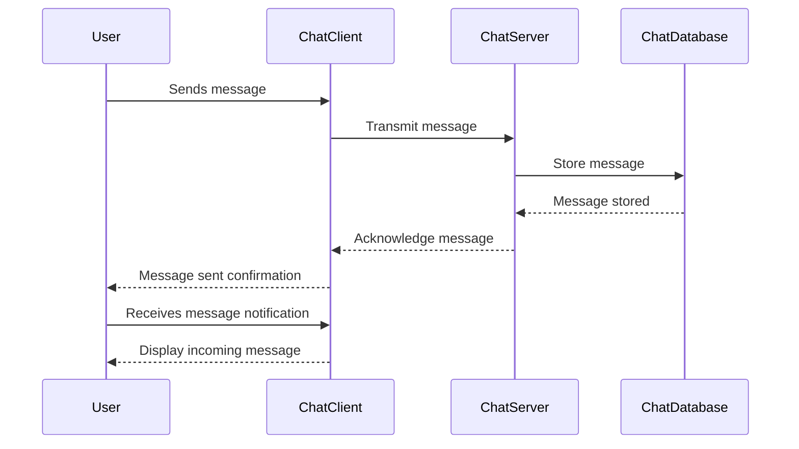

# Real-Time Chat App Sequence Diagram

This repository contains the sequence diagram for a real-time chat application. The diagram illustrates the interaction between different components such as the User, ChatClient, ChatServer, and ChatDatabase.

## System Overview

